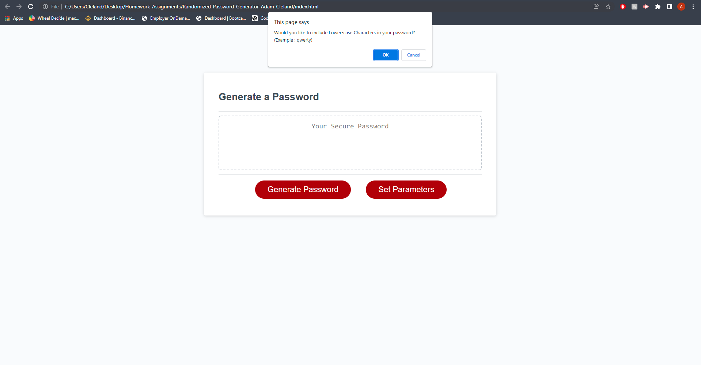

# Randomized-Password-Generator-Adam-Cleland
Third homework for the OSU Coding Boot-Camp; the Randomized password generator;
We were tasked with writing the javascript that allows this program to function properly.
## In this Program

    1. The user is able to choose the amount of characters for the password.
    2. The user is able to choose what type of characters to be included.
    3. The user has the choice between 8 - 128 characters, and between; uppercase, lowercase, numbers, and special characters.
    3. The user can generate a random password that will follow the parameters provided.

## Installation
Use Gitbash to clone the repository using SSH

Or download the Repo and launch the index.html into your web browser

## Links

GitHub Repo : (https://github.com/aclelandx/Randomized-Password-Generator-Adam-Cleland)

GitHub Pages : (https://aclelandx.github.io/Randomized-Password-Generator-Adam-Cleland/)

## Screenshots

## Contributing
html / css was provided by the OSU bootcamp for coding
js was created by Adam Cleland. 

## License 
MIT License

Copyright (c) [2022] [Adam Cleland]

Permission is hereby granted, free of charge, to any person obtaining a copy
of this software and associated documentation files (the "Software"), to deal
in the Software without restriction, including without limitation the rights
to use, copy, modify, merge, publish, distribute, sublicense, and/or sell
copies of the Software, and to permit persons to whom the Software is
furnished to do so, subject to the following conditions:

The above copyright notice and this permission notice shall be included in all
copies or substantial portions of the Software.

THE SOFTWARE IS PROVIDED "AS IS", WITHOUT WARRANTY OF ANY KIND, EXPRESS OR
IMPLIED, INCLUDING BUT NOT LIMITED TO THE WARRANTIES OF MERCHANTABILITY,
FITNESS FOR A PARTICULAR PURPOSE AND NONINFRINGEMENT. IN NO EVENT SHALL THE
AUTHORS OR COPYRIGHT HOLDERS BE LIABLE FOR ANY CLAIM, DAMAGES OR OTHER
LIABILITY, WHETHER IN AN ACTION OF CONTRACT, TORT OR OTHERWISE, ARISING FROM,
OUT OF OR IN CONNECTION WITH THE SOFTWARE OR THE USE OR OTHER DEALINGS IN THE
SOFTWARE.
